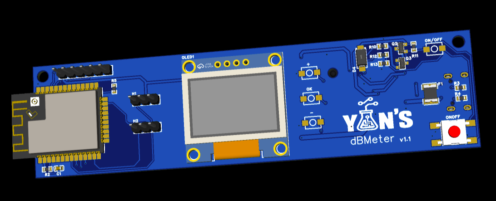
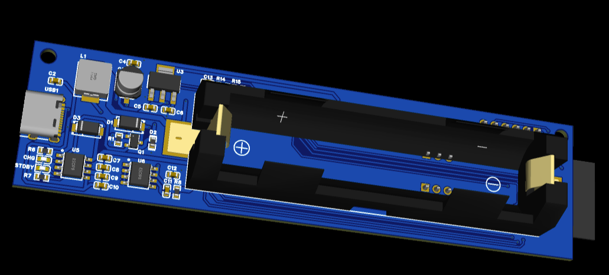
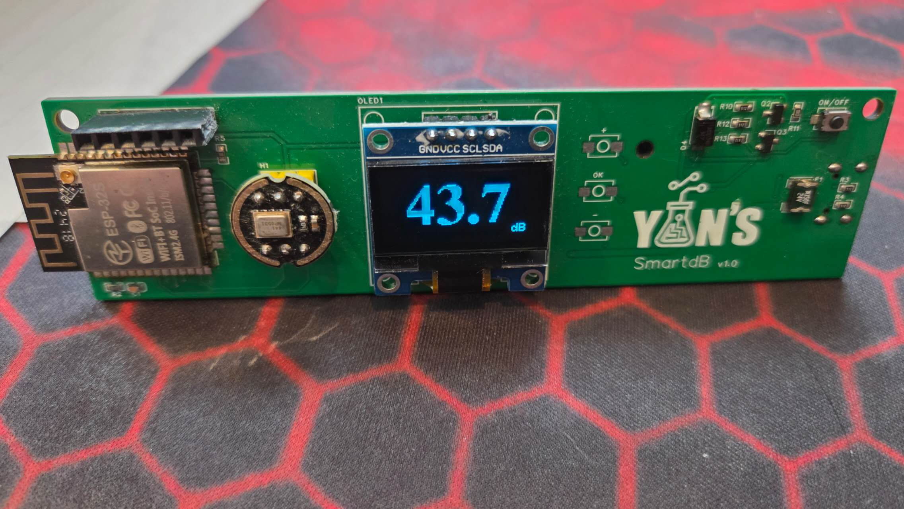

# ESP32 dbMeter / ESP32 分贝计

------

### 📊 Overview

A professional sound level meter based on ESP32 and I2S digital microphone, featuring real-time dB measurement, OLED display, and seamless MQTT integration for Home Assistant.

### ✨ Features

- 🎤 **I2S Digital Microphone** - INMP441, ICS-43434, SPH0645LM4H-B support

- 📈 **Real-time Measurement** - A-weighting and C-weighting filters

- 🖥️ **OLED Display** - Local monitoring on 128x64 display

- 📡 **MQTT Integration** - Auto-discovery for Home Assistant

- 🔄 **OTA Updates** - Wireless firmware updates

- ⚡ **High Performance** - 48kHz sampling with 24-bit resolution

  

  

  

### 🛠️ Hardware Requirements

| Component       | Model               | Notes                       |
| --------------- | ------------------- | --------------------------- |
| Microcontroller | ESP32 Dev Module    | Any ESP32 board             |
| Microphone      | INMP441             | Or ICS-43434, SPH0645LM4H-B |
| Display         | SSD1306 128x64 OLED | I2C interface               |
| Power Supply    | 5V/1A               | USB or battery              |

### 🙏 Credits

Based on excellent work by [Ivan Kostoski](https://github.com/ikostoski/esp32-i2s-slm)

### 📄 License

MIT License - See LICENSE file for details

### 🤝 Contributing

Contributions welcome! Please submit Pull Requests or open Issues on GitHub.

------

## 中文

### 📊 项目简介

基于 ESP32 和 I2S 麦克风的专业声级计，支持实时 dB 测量、OLED 显示以及通过 MQTT 无缝集成到 Home Assistant。

### ✨ 功能特性

- 🎤 **I2S 数字麦克风** - 支持 INMP441、ICS-43434、SPH0645LM4H-B
- 📈 **实时测量** - A 计权和 C 计权滤波
- 🖥️ **OLED 显示** - 128x64 显示屏本地监控
- 📡 **MQTT 集成** - Home Assistant 自动发现
- 🔄 **OTA 更新** - 无线固件升级
- ⚡ **高性能** - 48kHz 采样，24 位分辨率

### 🛠️ 硬件需求

| 组件   | 型号                | 备注                        |
| ------ | ------------------- | --------------------------- |
| 主控   | ESP32 开发板        | 任意 ESP32 板               |
| 麦克风 | INMP441             | 或 ICS-43434、SPH0645LM4H-B |
| 显示屏 | SSD1306 128x64 OLED | I2C 接口                    |
| 电源   | 5V/1A               | USB 或电池                  |

### 🙏 致谢

基于 [Ivan Kostoski](https://github.com/ikostoski/esp32-i2s-slm) 的优秀工作

### 📄 许可证

MIT 许可证 - 详见 LICENSE 文件